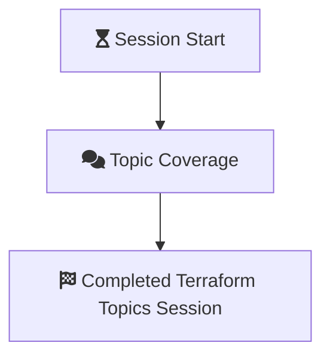

# Terraform Topics Tuesdays

- [Terraform Topics Tuesdays](#terraform-topics-tuesdays)
  - [Overview](#overview)
    - [Polyglot Notebooks](#polyglot-notebooks)
  - [Session 1 - Terraform Cloud](#session-1---terraform-cloud)
  - [Session 2 - Generating Resources](#session-2---generating-resources)
  - [Session 3 - Terraform CLI](#session-3---terraform-cli)
- [Session 4 - Multi-Environment Provisioning](#session-4---multi-environment-provisioning)
  - [Mermaid Markdown](#mermaid-markdown)

## Overview

Terraform Topics Tuesdays plans to cover a practitioner's level of terraform while steadily targeting more advanced topics.

Current Session Outline:

1. Setup and configuration of Terraform Cloud
2. Deploying resources with a provider (Azure, AWS, Docker, GCP, GitHub, Terraform Enterprise)
3. Terraform CLI (I know this wasn't highly ranked, but it is pretty important to cover before we go deeper!)
4. Configure resources for multi-environment deployments
5. State manipulation (remove, move, import)
6. How and when to build a module.
7. When to scale wide with your Infrastructure Codebase and Workspaces
8. Terraform Functions
9. Integration with HashiCorp Vault
10. Testing your Terraform

Sessions are currently planned to be covered by Matt Braunwart and special guests! If you'd like to cover a topic listed or have one of your own, please let me know!

<a href="mailto:matt.braunwart@insight.com">Matt Braunwart @ insight.com</a>

### Polyglot Notebooks

Most content in these sessions are produced in [Polyglot Notebooks](https://github.com/dotnet/interactive). [VS Code Extension](https://marketplace.visualstudio.com/items?itemName=ms-dotnettools.dotnet-interactive-vscode)

> With the Polyglot Notebooks extension, you can use multiple languages in the same notebook and share variables between them. No more installing different Jupyter kernels, using wrapper libraries, or different tools to get the best language server support for the language of your choice. Always use the best language for the job and seamlessly transition between different states of your workflow, all within one notebook.

## Session 1 - Terraform Cloud

10-04-2022

[Terraform Cloud - Recording](https://insightonline.sharepoint.com/:v:/r/sites/DIHashicorp/Shared%20Documents/Terraform/Terraform%20Topics%20Tuesdays/Terraform%20Topics%20Tuesdays-20221004_120130-Meeting%20Recording.mp4?csf=1&web=1&e=0POVUq&isSPOFile=1)

All content can be found in `./Session 1 - Terraform Cloud`. Content of this session contains a Polyglot Notebook with markdown and commands presenting the session. Infrastructure as code used within this session reside in `./Session 1 - Terraform Cloud/tfc_workspace` and `./Session 1 - Terraform Cloud/tfc_module`.

- General overview of Terraform Cloud
- Creating a workspace in Terraform Cloud
- Running terraform commands remotely.
- Publishing a module in the Private Module Registry.

## Session 2 - Generating Resources

10-18-2022

[Generating Resources - Recording](https://insightonline.sharepoint.com/:v:/r/sites/DIHashicorp/Shared%20Documents/Terraform/Terraform%20Topics%20Tuesdays/Terraform%20Topics%20Tuesdays-20221018_120435-Meeting%20Recording.mp4?csf=1&web=1&e=Mij5jV)

All content can be found in `./Session 2 - Creating Resources`. Content of this session is produced on a Polyglot Notebook. In this particular content it was used primarily for markdown documentation. \
Several pieces of terraform are laid out in folders. A NodeJS app was created for an example generating a Docker image using the Docker provider. 

- Anatomy of a Resource
- Building Resources for Terraform Enterprise
- Building Base Azure Resources
- Building Docker Image and Publish to Registry
- Building Azure Linux App Service

## Session 3 - Terraform CLI

11-01-2022

[Terraform CLI - Recording](https://insightonline.sharepoint.com/:v:/r/sites/DIHashicorp/Shared%20Documents/Terraform/Terraform%20Topics%20Tuesdays/Terraform%20Topics%20Tuesdays-20221101_120015-Meeting%20Recording.mp4?csf=1&web=1&e=b9VXA1&isSPOFile=1)

All content can be found in `./Session 3 - Terraform CLI`. Content of this session is produced on a Polyglot Notebook.

The terraform included in this session is the same as the TFE terrform from [Session 2 - Generating Resources](#session-2---generating-resources).

- Terraform CLI Commands
  - Overview
  - Init
  - Validate
  - Plan
  - Apply
  - Destroy
  - Format
  - Console
  - Show
  - State List and State Show

## Session 4 - Multi-Environment Provisioning

11-15-2022

[Multi-Environment Provisioning](https://insightonline.sharepoint.com/:v:/r/sites/DIHashicorp/Shared%20Documents/Terraform/Terraform%20Topics%20Tuesdays/Terraform%20Topics%20Tuesdays-20221115_120112-Meeting%20Recording.mp4?csf=1&web=1&e=18M7Uh)

All content can be found in `./Session 4 - Multi-Environment Provisioning`. Content of this session is produced on a Polyglot Notebook and features some small flowcharts with mermaid.

- In this session we briefly covered multi-environment management options with tooling.
  - `terraform workspace` CLI 
  - Environment based branching (no live example)
  - Brief overview of Terragrunt (no running code)
  - Terraform Cloud Workspaces and Automation with Environment Variables.
- Writing code for environment based deployments (Keeping it DRY)

### Mermaid Markdown

> It is a JavaScript based diagramming and charting tool that renders Markdown-inspired text definitions to create and modify diagrams dynamically.

- [Mermaid Markdown](https://mermaid-js.github.io/mermaid/#/)
  - [Mermaid - Live Editor](https://mermaid.live/)

## Session 5 - State Manipulation

[State Manipulation](https://insightonline.sharepoint.com/:v:/r/sites/DIHashicorp/Shared%20Documents/Terraform/Terraform%20Topics%20Tuesdays/Terraform%20Topics%20Tuesdays-20221129_120157-Meeting%20Recording.mp4?csf=1&web=1&e=2As7nx)

All content can be found in `./Session 5 - State Manipulation`. Content of this session is produced on a Polyglot Notebook.

- What is state?
  - Purpose of state
  - Resource Addressing
- State
- Managing state
  - Imports - `terraform import`
  - Move - `terraform state mv`
    - `moved` block
  - Remove - `terraform state rm`
  - Pull & Push - `terraform state pull` & `terraform state push`
- Reading the state file
  - State List - `terraform state list`
  - State Show - `terraform state show`
  - Show - `terraform show`
  - Graph - `terraform graph`
